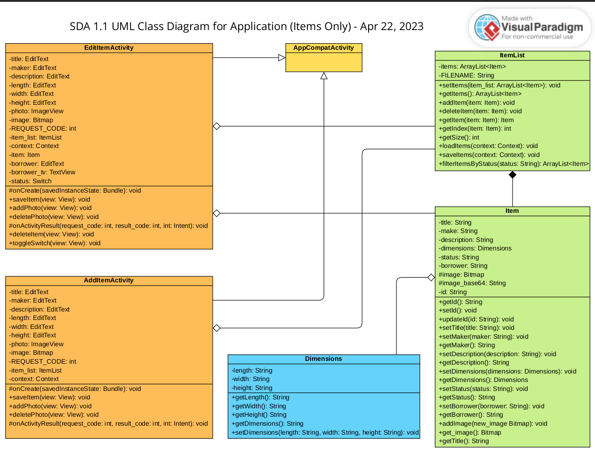
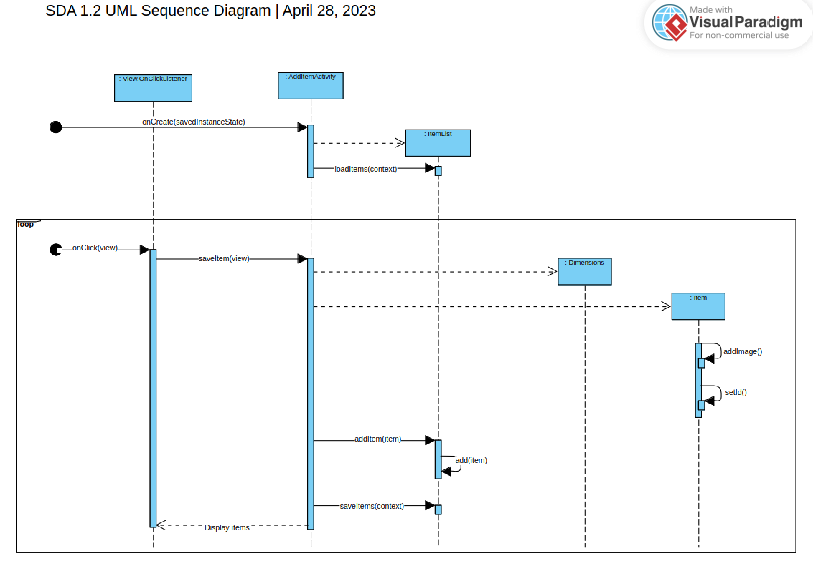
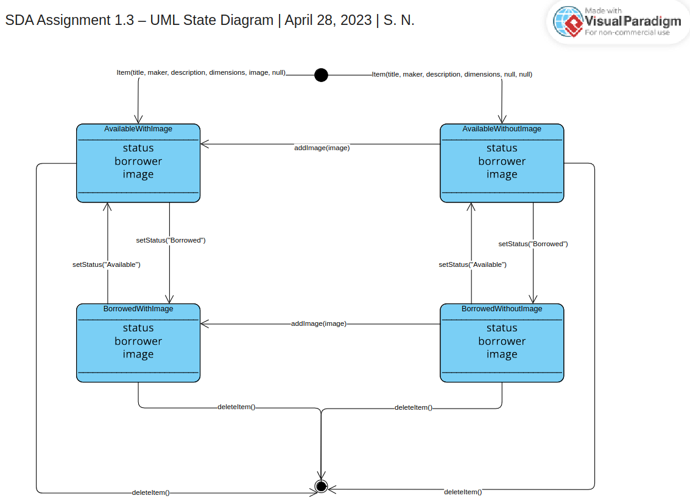

# SharingApp
An android app to share items with contacts!

This project was my capstone assignment for [Object-Oriented Design course](https://www.coursera.org/learn/object-oriented-design?specialization=software-design-architecture) in Coursera by the amazing Alberta University instructors.

Everything after the initial commit is what I've contributed to the project; which is adding `Contact` and `ContactList` 
and their respective layouts and activities.

# Installation
  Follow the instruction of [this](https://d3c33hcgiwev3.cloudfront.net/g4HCKETcRP6BwihE3AT-Hg_9bdce603603f4fdb98cebe5f5599ee47__Android-Studio-4-Android-10-Upgrade-Tutorial-C1-Items-only-Contacts-.pdf?Expires=1685836800&Signature=izxtWK3yUobOyA33uqu0aSzSH0idPP4luBolw0GE1cKX2yIE8szDPilCrlTSx1HYADWkhUNEU6~qKnbE2bMiEID-DoxrvhteV4oia0g5JFTSwveHJNZgXnggoyaM6MAGflyR7AYgg25vVcKFPhfiOzy1GdH3Smtnk6~f4H9kTFc_&Key-Pair-Id=APKAJLTNE6QMUY6HBC5A)
  file given in the course you can setup the project.
  
# Demo
  [This video](https://youtu.be/knH3OFZM23k) demonstrates the app.
  
  [This](https://d3c33hcgiwev3.cloudfront.net/imageAssetProxy.v1/_378261654f7e71fc7355bb8aa5d67853_UML-Class-Diagram-Contacts.png?expiry=1685836800000&hmac=tcTllbqGYC9oHaOLgfWYcgoZkaIVy-_lAU1RT3mHHog) is a UML class diagram of the final version of the app.
  
#### UML Diagrams before adding contacts (items only)
- UML Class Diagram (Capstone Assignment 1.1)

- UML Sequence Diagram (Capstone Assignment 1.2)

- UML State Diagram (Capstone Assignment 1.3)

